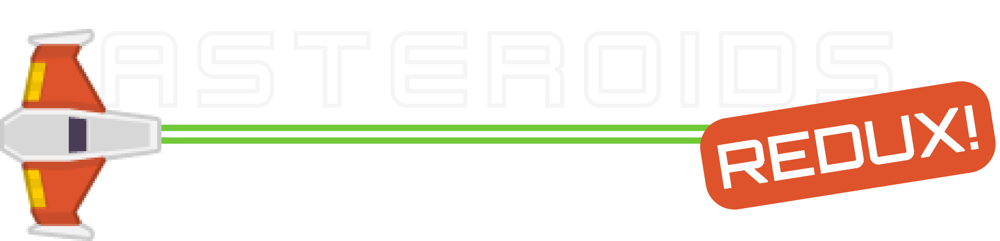
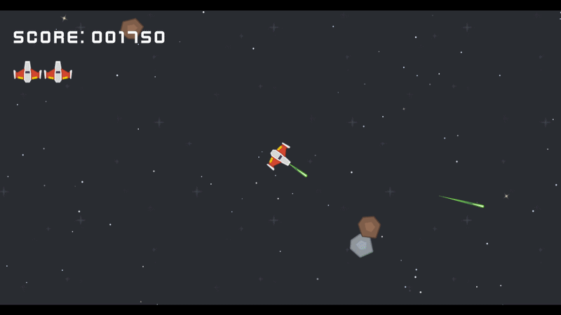
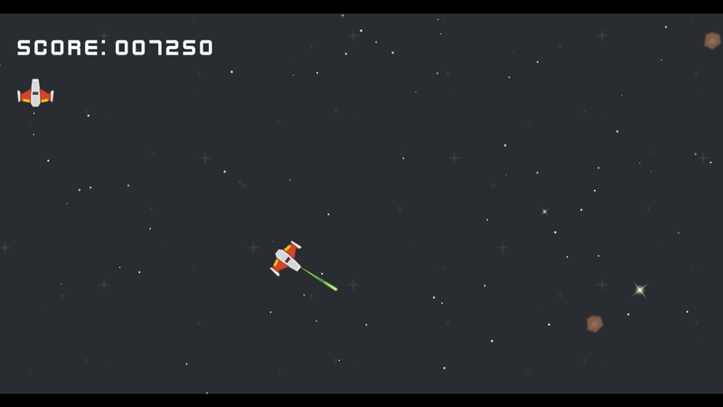
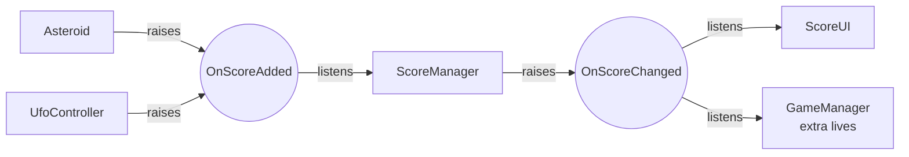
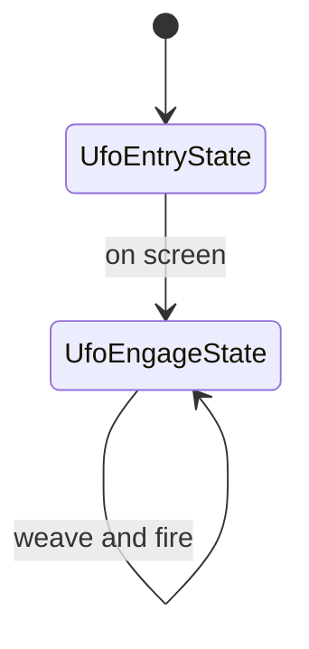
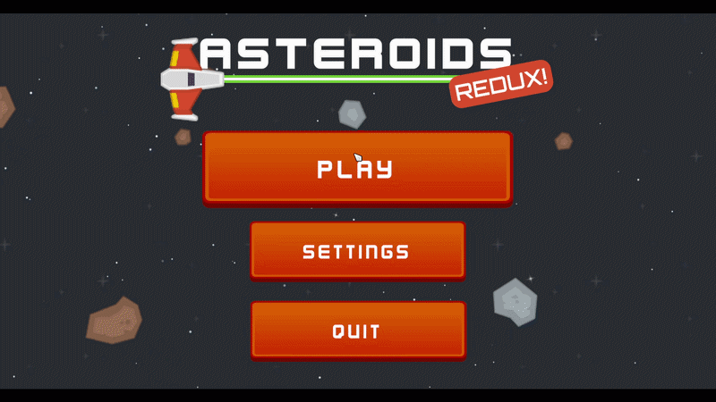
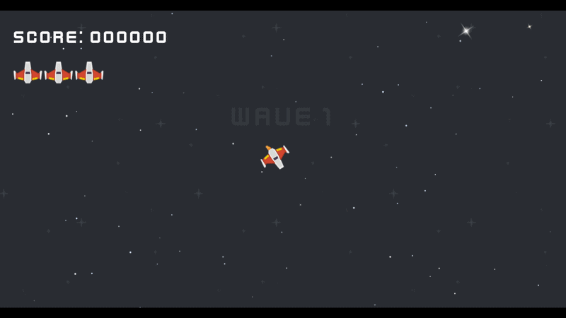

<div align="center">



**A polished 2D Asteroids game in Unity, built as a showcase of clean, decoupled game architecture.**


<!-- Hero GIF: ~10-15s of real gameplay (a wave being cleared, ending on the slow-mo shockwave) -->


<!-- Optional: [▶ Play in browser](https://your-itch-or-webgl-link) · [Download](https://your-release-link) -->

</div>

---

## About

Asteroids Redux is a complete game loop: main menu, loading screen, intro, endless waves of escalating difficulty, UFO enemies with AI, hyperspace, extra lives, pause and audio settings, game over and back to the menu.

It was built as a portfolio piece. The gameplay is deliberately familiar, so the interesting part is **how it's put together**: every system is decoupled, data-driven and covered by tests where it matters. Each section below explains a system and *why* it was built that way.

## Features

- Arcade thrust-and-rotate flight with screen wrapping
- Asteroids that split into smaller pieces, each size with its own score and screen shake
- UFO enemies driven by a state machine, with several variants unlocked by wave number
- Endless waves with count, speed and UFO frequency all ramping from a single config asset
- Hyperspace jump with a risk of destroying the ship, as in the arcade original
- Wave-clear slow motion with a full-screen shockwave shader
- Screen shake, pooled VFX and mixed audio with Master/Music/SFX sliders saved between sessions
- Main menu, additive loading screen with fades, pause menu and game over screen

<table>
  <tr>
    <td></td>
    <td></td>
  </tr>
  <tr>
    <td></td>
    <td></td>
  </tr>
</table>

## Controls

| Action | Keyboard | Mouse |
| --- | --- | --- |
| Thrust | `W` / `↑` | |
| Rotate | `A` `D` / `←` `→` | |
| Fire | `Space` | Left button |
| Hyperspace | `Left Shift` | Right button |
| Pause | `Esc` / `P` | |

## Tech stack

| | |
| --- | --- |
| Engine | Unity 6000.0.62f1 (Unity 6) |
| Rendering | Universal Render Pipeline (2D Renderer), custom full-screen shader pass |
| Input | Unity Input System |
| UI | TextMeshPro |
| Language | C# |
| Testing | Unity Test Framework (NUnit), EditMode |

---

## Architecture highlights

### 1. Event channels (Observer pattern with ScriptableObjects)



Cross-system communication (score, lives, player death, pause/resume, game over, wave start and clear, screen shake) goes through `ScriptableObject` event channels (`VoidEventChannelSO`, `IntEventChannelSO`, `Vector3EventChannelSO`, `ScreenShakeEventChannelSO`). A publisher such as `Asteroid` raises an event on a channel asset; a subscriber such as `ScoreManager` listens to the same asset. Neither has a reference to the other.

**Why it's good**
- **No hard dependencies.** Score, UI, audio and effects can be removed, replaced or tested on their own.
- **Wired in the editor, not in code.** Designers can hook a new listener to an existing event without touching a script.
- **Easy to debug.** Every event is a visible asset in `Data/Events`, so you can see exactly what the game can say.

### 2. Data-driven design (ScriptableObject configs)


Ship handling, weapons, asteroid sizes, UFO stats and the whole difficulty curve live in config assets (`ShipConfig`, `WeaponConfig`, `AsteroidConfig`, `UfoConfigSO`, `WaveConfig`), not on components. Configs even own the behaviour around themselves: `WaveConfig` exposes `AsteroidCountForWave(n)`, `AsteroidSpeedMultiplierForWave(n)`, `UfoSpawnIntervalForWave(n)` and `UfoFireRateForWave(n)`, each clamped to a configurable floor or cap.

**Why it's good**
- **Rebalance without recompiling.** Tuning is done in the inspector, including during play mode.
- **Variants are free.** A new ship, weapon or difficulty mode is a new asset, not new code.
- **The scaling math is testable.** Because it lives in plain methods on the config, it has unit tests (see [Testing](#testing)).

### 3. Finite state machine for enemy AI



The UFO (`UfoController`) is driven by a small interface-based state machine (`IState` / `StateMachine`). `UfoEntryState` flies it in from off-screen, then hands over to `UfoEngageState`, which weaves around the player and fires aimed shots. Each state owns its own enter, update and exit logic.

**Why it's good**
- **Behaviour is isolated.** Adding a new behaviour (retreat, dodge, boss phase) means writing a new state, not growing an `if` chain in the controller.
- **The machine is generic.** `StateMachine` knows nothing about UFOs, so it is unit tested with plain test states.

### 4. Object pooling

Bullets, asteroids, UFOs and every one-shot effect are recycled through a single `ObjectPool`. Pools are keyed by prefab instance ID (so two prefabs with the same name can't collide) and objects implement `IPoolable` (`OnSpawnFromPool` / `OnReturnToPool`) to reset their own state. Returns are guarded against double-release, for example a bullet overlapping two asteroids in the same physics step.

The pool also **prewarms across frames** and exposes `IsReady`, so the loading screen can keep animating while it fills and then hand over to the game without a hitch.

**Why it's good**
- **No allocation spikes in combat.** No per-shot `Instantiate`/`Destroy`, so no garbage collector hiccups when the screen fills up.
- **Objects own their reset logic**, so the pool stays generic and doesn't know what a bullet is.

### 5. Reliable wave clearing (`EnemyTracker`)

A wave ends when every asteroid and UFO is gone. Instead of searching the scene for enemies, `EnemyTracker` keeps counters that enemies update as they enable and disable, and the count can never go negative. The wave manager also stops spawning UFOs once the last asteroid is gone, so a wave can always finish.

**Why it's good**
- **O(1) checks** instead of `FindObjectsOfType` scans.
- **Works with pooling**, since pooled objects enable and disable rather than being created and destroyed.
- **Unit tested**, including the edge cases (double disable, reset between runs).

### 6. Audio architecture

Every `AudioSource` routes to a Music or SFX group under Master (UI sounds sit under SFX). The settings screen drives exposed mixer parameters (slider value converted to decibels) and saves them in `PlayerPrefs`. Pausing sets `AudioListener.pause` so gameplay sound stops while music and UI sounds keep playing, and the music crossfades to a separate pause track. Effects pick a random clip and pitch and cap how many copies of their sound can play at once, so chain explosions don't clip.

**Why it's good**
- **One place controls volume.** Nothing in gameplay code touches volume.
- **Pause feels right** without special-casing every audio source.

---

## Game feel & polish

<table>
  <tr>
    <td width="50%">
      <br>
      <b>Wave-clear slow motion + shockwave</b><br>
      The kill that empties a wave slows time, physics steps and mixer pitch together, and sends a ring of screen distortion from where the enemy died, using a full-screen shader pass on the 2D Renderer.
    </td>
    <td width="50%">
      <br>
      <b>Screen shake</b><br>
      Asteroids (per size), UFOs and the ship each define a shake (strength, duration, frequency) in their config and raise it through an event channel. Overlapping shakes add up to a cap, run on game time so they slow with the slow motion, and are only applied while the camera renders, so screen wrapping never sees the offset.
    </td>
  </tr>
  <tr>
    <td width="50%">
      <br>
      <b>Scene transitions & loading screen</b><br>
      A persistent <code>SceneLoader</code> fades the screen and all audio between scenes. The game scene loads additively under a loading scene (the ship wandering over a big "LOADING" text) and is revealed only once the object pool is ready, so the intro and music start when the player can actually see them.
    </td>
    <td width="50%">
      <br>
      <b>Hyperspace</b><br>
      The ship vanishes and reappears at a random on-screen spot, preferring one away from enemies. Re-entry has a configurable chance to destroy the ship, as in the arcade original.
    </td>
  </tr>
</table>

## Gameplay systems

| System | Scripts | What it does |
| --- | --- | --- |
| Player | `PlayerController`, `PlayerShooter`, `PlayerHealth`, `PlayerHyperspace` | Thrust/rotate flight, pooled bullet firing on a cooldown, trigger-based death, hyperspace |
| Asteroids | `Asteroid`, `AsteroidConfig` | Drift and rotate, wrap around the screen, split into smaller sizes when destroyed |
| UFOs | `UfoController`, `UfoEntryState`, `UfoEngageState` | State-machine AI; engine audio volume scales with distance to the screen |
| Waves | `WaveManager`, `WaveConfig`, `WaveUI` | Scaled asteroid counts and speeds, weighted UFO variants unlocked by wave, shrinking spawn timer, clear detection |
| Scoring & lives | `ScoreManager`, `GameManager`, `ScoreUI`, `LivesUI` | Score via events, bonus life every 10,000 points (capped), respawn with blinking invulnerability |
| Game flow | `GameIntro`, `PauseManager`, `GameOverUI`, `SceneLoader` | Pre-game controls hint, pause, game over with restart and menu |
| Menus & UI | `MainMenuUI`, `SettingsUI`, `MenuAsteroidField`, `UIPulse`, `UIHoverScale`, `ButtonPressEffect` | Menu with live asteroid background, settings with mute toggles, button feedback |
| Effects | `EffectSO`, `PooledEffect`, `SlowMotionEffect`, `ShockwaveEffect`, `CameraShake` | Pooled one-shot VFX/SFX described by assets, plus the juice effects above |
| Utility | `ScreenWrapper`, `SpawnPoints` | Shared screen-wrap and off-screen spawn math |

## Testing

EditMode tests cover the logic that is easiest to break silently, using NUnit through the Unity Test Framework:

| Suite | Covers |
| --- | --- |
| `WaveConfigTests` | Difficulty ramps start at their base value and respect their caps and floors |
| `EnemyTrackerTests` | Counting, separate asteroid/UFO totals, never going negative, reset |
| `StateMachineTests` | Old state exits before the new one enters, redundant or null transitions are ignored, updates reach only the current state |
| `EventChannelTests` | Values reach every subscriber, unsubscribing stops delivery, raising with no subscribers is safe |

Run them from **Window → General → Test Runner → EditMode → Run All**.

## Project structure

```
Assets/
├── Art/            Sprites, UI, fonts, effect textures/materials, shockwave shader
├── Audio/          SFX, music and the AudioMixer
├── Data/           ScriptableObject assets (Enemies, Ship, Weapons, Waves, Effects, Events)
├── Prefabs/        Enemies, projectiles, effects, systems and UI
├── Scenes/         MainMenuScene, LoadingScene, GameScene
├── Tests/          EditMode tests
└── Scripts/
    ├── Audio/            Music, UI sounds, mixer channels
    ├── Combat/           Bullet, IDamageable
    ├── Effects/          EffectSO, pooled VFX, slow motion, shockwave, camera shake
    ├── Enemies/          Asteroid, EnemyTracker, UFO and its state machine
    ├── Events/           ScriptableObject event channels
    ├── Managers/         Game, Pause, Score, Wave, Audio settings, Scene loading, Intro
    ├── Player/           Controller, shooter, health, hyperspace
    ├── Pooling/          Generic object pooling
    ├── ScriptableObjects/ Ship, Weapon, Asteroid, UFO and Wave configs
    ├── UI/               HUD, menus, loading screen, button effects
    └── Utility/          Screen wrapping, spawn points
```

## Getting started

1. Install [Unity Hub](https://unity.com/download) and the editor version **6000.0.62f1**.
2. Clone the repository and open the repository root from Unity Hub.
3. Open `Assets/Scenes/MainMenuScene.unity` and press **Play**.

## Credits

- Visual and sound assets: [Kenney](https://kenney.nl) (CC0)
- Some sound effects: [Freesound](https://freesound.org)
- Built with the help of [Claude Code](https://claude.com/claude-code) for code and documentation
